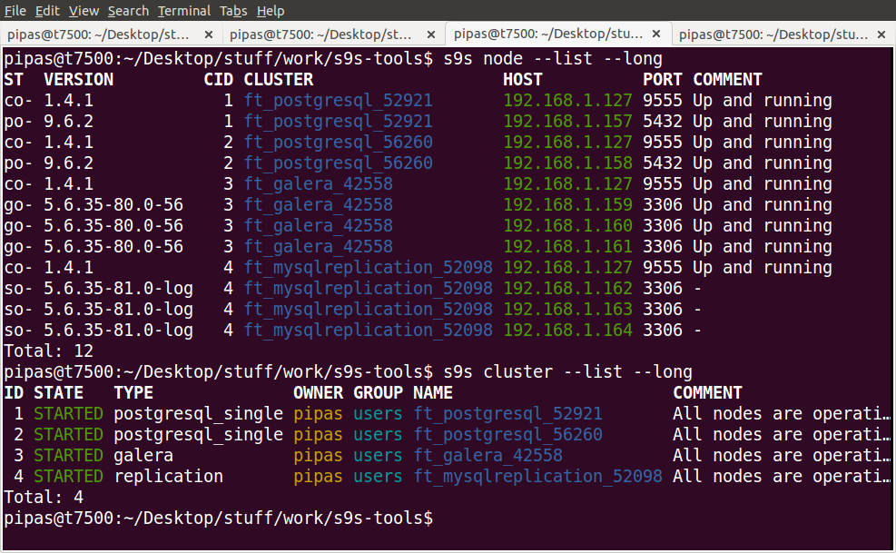
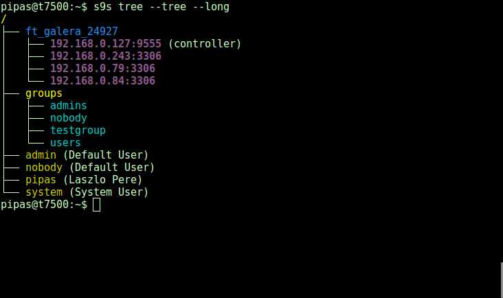
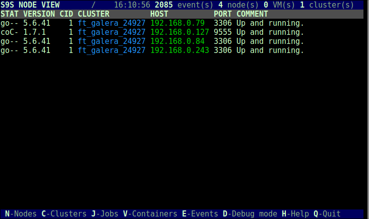
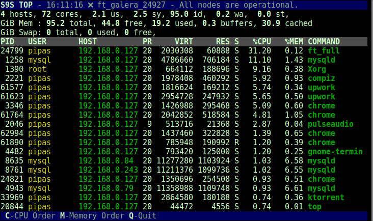
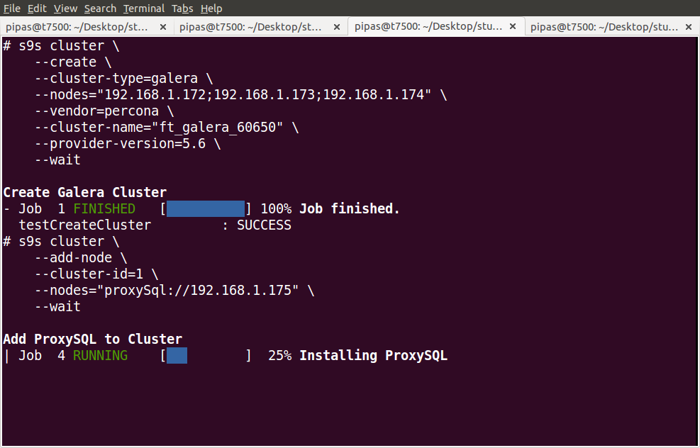

# s9s-tools

Repository for tools helping to manage and monitor your Severalnines clusters. 
The repository contains the following tools:
- s9s  (cli)

# APT and YUM repositories

Well these repositories are updated on few weekly basis currently.

## Ubuntu DEB repository

LINK: https://launchpad.net/~severalnines/+archive/ubuntu/s9s-tools

```
sudo add-apt-repository ppa:severalnines/s9s-tools
sudo apt-get update
sudo apt-get install s9s-tools
```

## YUM Repositories for CentOS 6/7 and RHEL 6/7

LINK: https://build.opensuse.org/repositories/home:kedazo/s9s-tools

The repository files for each distribution:
- http://download.opensuse.org/repositories/home:/kedazo/CentOS_6/home:kedazo.repo
- http://download.opensuse.org/repositories/home:/kedazo/CentOS_7/home:kedazo.repo
- http://download.opensuse.org/repositories/home:/kedazo/RHEL_6/home:kedazo.repo
- http://download.opensuse.org/repositories/home:/kedazo/RHEL_7/home:kedazo.repo

# Some screenshots







