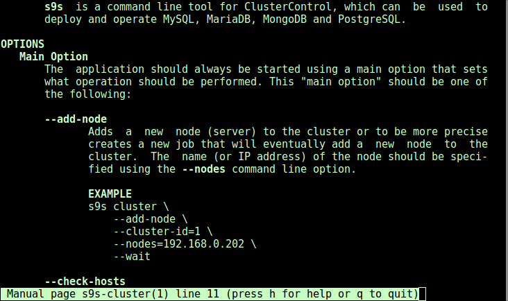
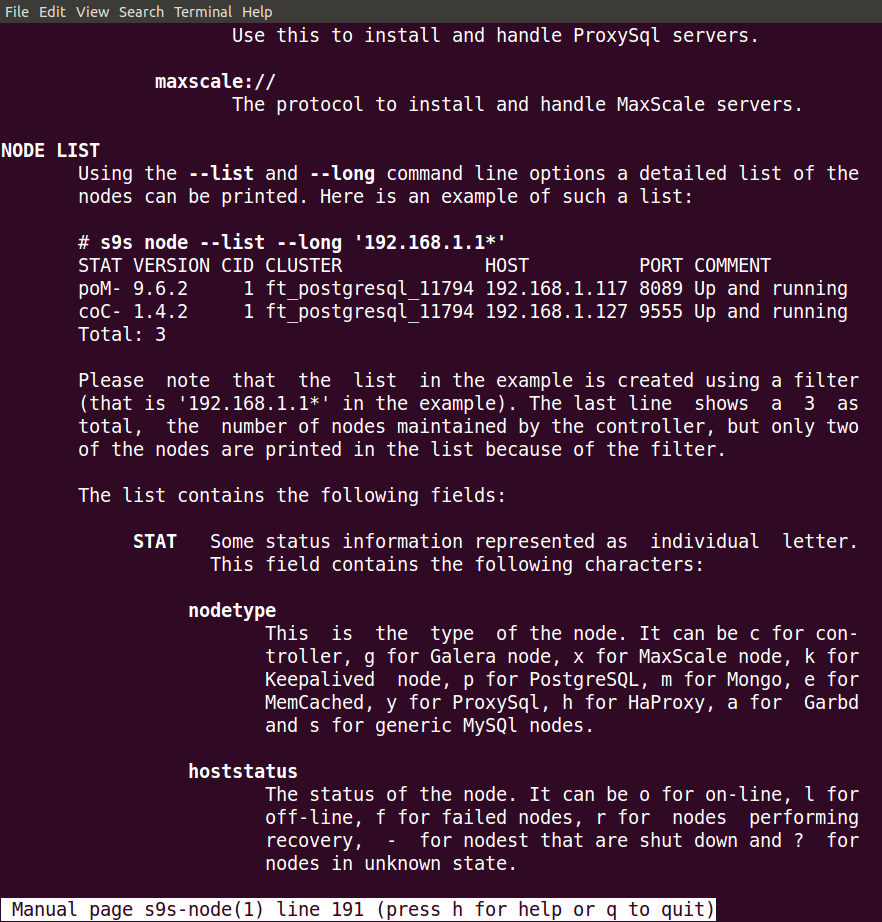
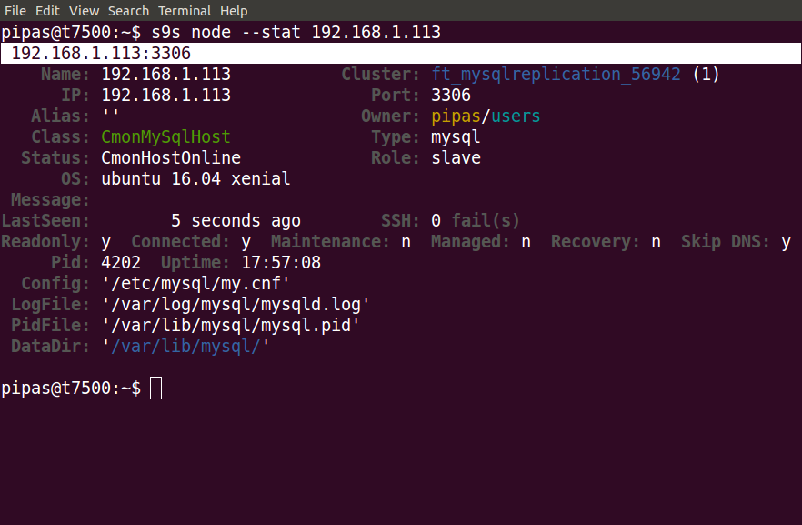

# s9s-tools

Repository for tools helping to manage and monitor your Severalnines clusters. 
The repository contains the following tools:
- s9s  (cli)

# Important

This git repository contains the sources of a development version of s9s-tools,
this might doesn't work with the current publicly avaible
clustercontrol-controller version, please check relevant versioned branches
(1.4.2_release).

# APT and YUM repositories

Well these repositories are updated on few weekly basis currently.

## Ubuntu DEB repository

LINK: https://launchpad.net/~severalnines/+archive/ubuntu/s9s-tools

```
sudo add-apt-repository ppa:severalnines/s9s-tools
sudo apt-get update
sudo apt-get install s9s-tools
```

## Debian (+Ubuntu) DEB repositories

See http://repo.severalnines.com/s9s-tools/

To add debian/ubuntu repos the following needs to be done
```
# Available distros: wheezy, jessie, precise, trusty, xenial, yakkety, zesty
DISTRO=jessie
wget -qO - http://repo.severalnines.com/s9s-tools/${DISTRO}/Release.key | sudo apt-key add -
echo "deb http://repo.severalnines.com/s9s-tools/${DISTRO}/ ./" | sudo tee /etc/apt/sources.list.d/s9s-tools.list
sudo apt-get update
sudo apt-get install s9s-tools
```

## YUM Repositories for CentOS 6/7 and RHEL 6/7

See http://repo.severalnines.com/s9s-tools/

The repository files for each distribution:
- http://repo.severalnines.com/s9s-tools/CentOS_6/s9s-tools.repo
- http://repo.severalnines.com/s9s-tools/CentOS_7/s9s-tools.repo
- http://repo.severalnines.com/s9s-tools/RHEL_6/s9s-tools.repo
- http://repo.severalnines.com/s9s-tools/RHEL_7/s9s-tools.repo

# Some screenshots






