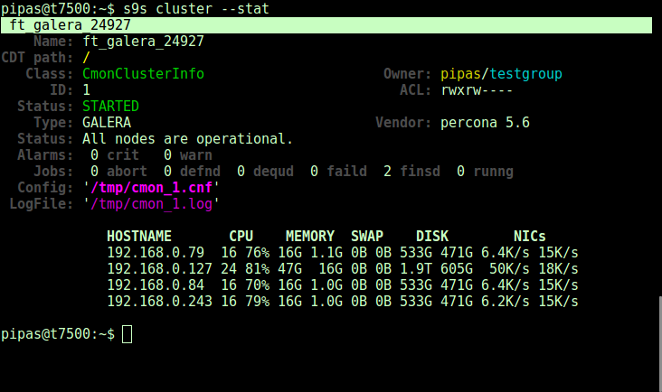
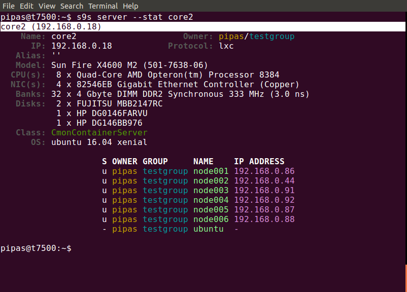

# s9s-tools

Repository for tools helping to manage and monitor your Severalnines clusters. 
The repository contains the following tools:
- s9s  (cli)

# Important

This git repository contains the sources of a development version of s9s-tools,
this might doesn't work with the current publicly avaible
clustercontrol-controller version, please check relevant versioned branches
(1.4.2_release).

# APT and YUM repositories

See http://repo.severalnines.com/s9s-tools/

You can use the following script to install s9s-tools automated:

http://repo.severalnines.com/s9s-tools/install-s9s-tools.sh

Download and run the script as sudo (it will set up the repository, installs and initializes the s9s CLI).

# Some screenshots

