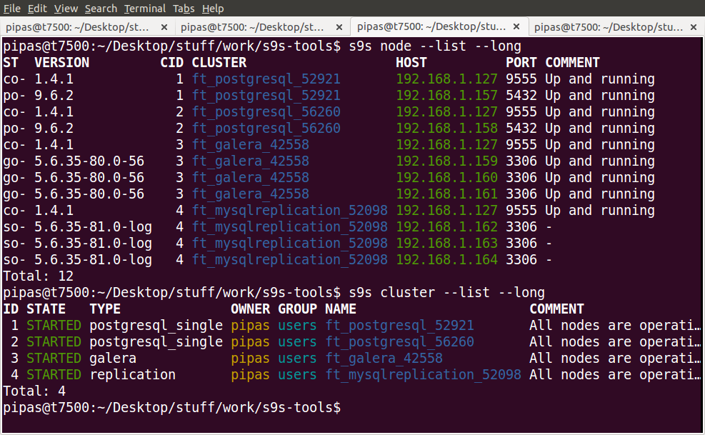
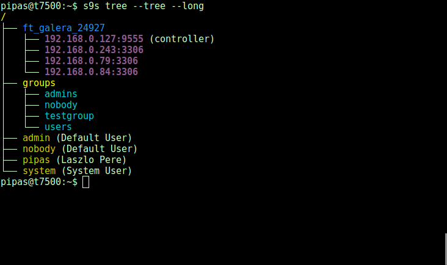
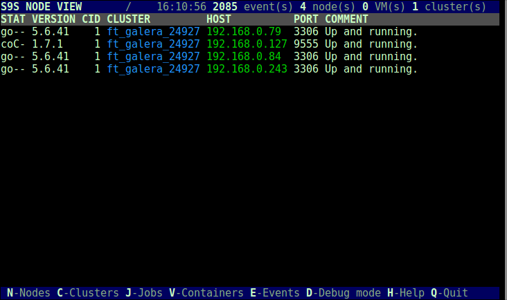
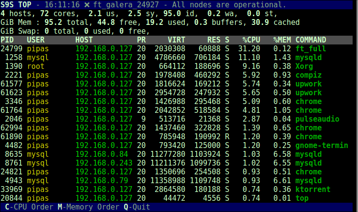
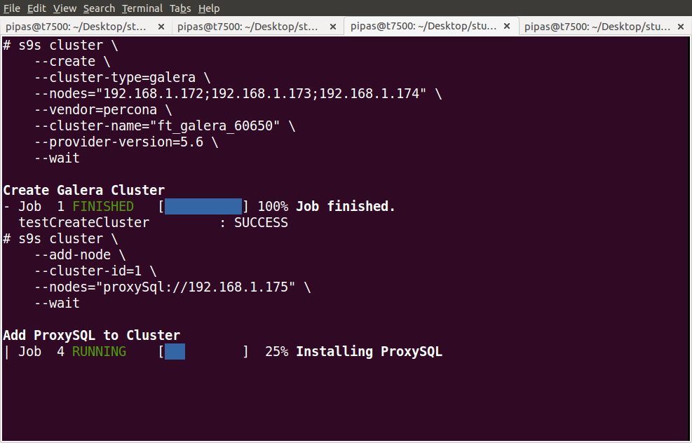
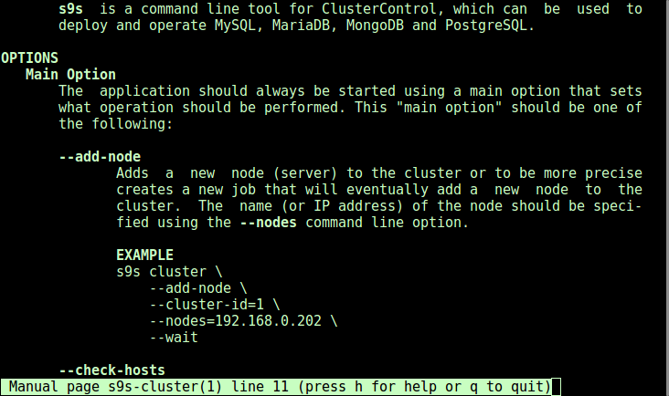
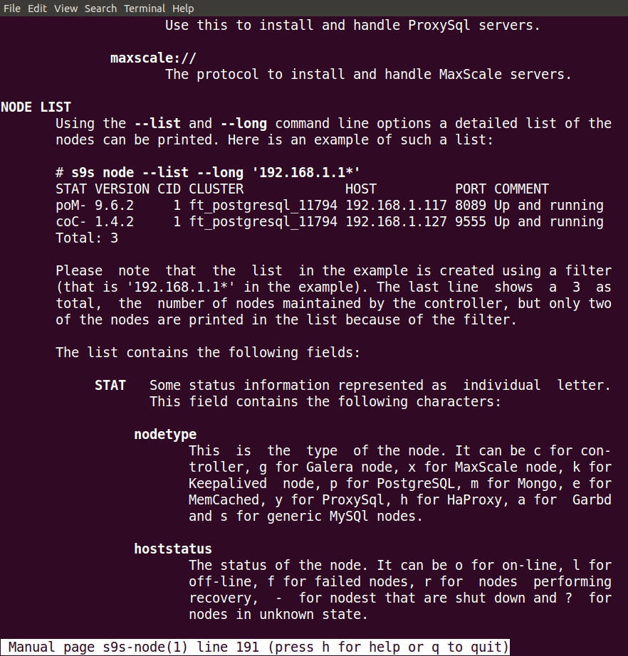
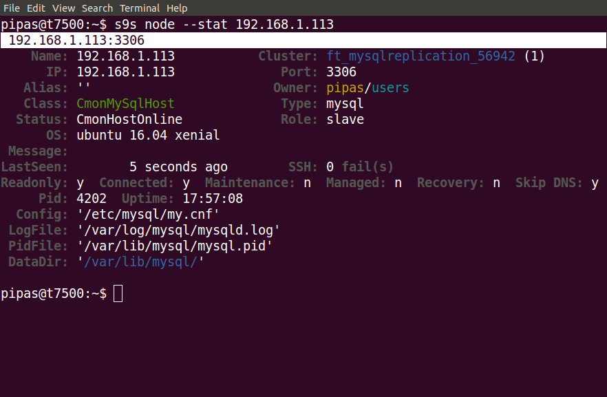
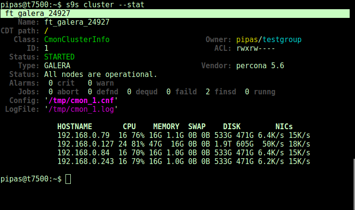
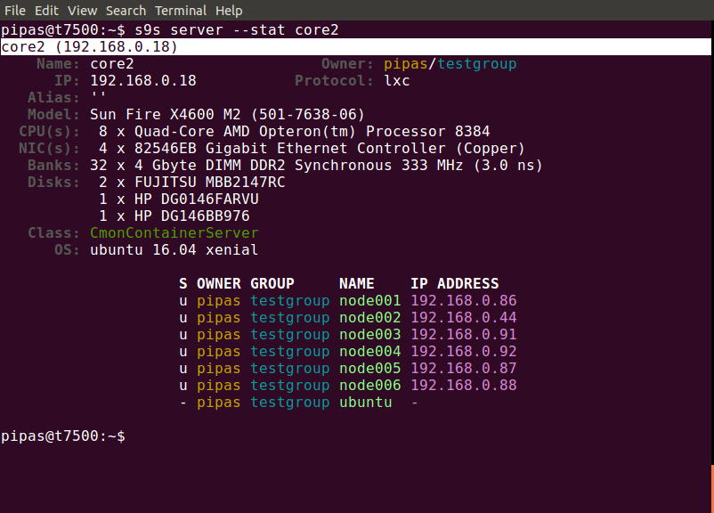

# s9s-tools

Repository for tools helping to manage and monitor your Severalnines clusters. 
The repository contains the following tools:
- s9s  (cli)

# Important

This git repository contains s9s-tools development version sources,
this might not work with the current publicly available
clustercontrol-controller version, please check relevant versioned branches
(1.4.2_release).

# APT and YUM repositories

See http://repo.severalnines.com/s9s-tools/

You can use the following script to install s9s-tools automated:

http://repo.severalnines.com/s9s-tools/install-s9s-tools.sh

Download and run the script as sudo (it will set up the repository, installs and initializes the s9s CLI).

# Some screenshots

# Dependencies for compilation on ubuntu24

sudo apt-get install libssl-dev flex bison

# Building local changes with Docker

The repository ships a `Dockerfile.ubuntu22.04` that builds `s9s` from the
current working tree. Use it to try out local changes without installing the
build toolchain on the host.

Build the image:

    docker build -f Dockerfile.ubuntu22.04 -t s9s-local .

The resulting image has `/usr/bin/s9s` as its entrypoint, so the container can
be used as a drop-in replacement for the `s9s` binary. A convenient alias that
keeps it side-by-side with any system-installed `s9s`:

    alias my-s9s='docker run --rm --network=host -v "$HOME/.s9s:/root/.s9s" s9s-local'

- `--network=host` lets the container reach a controller listening on
  `localhost` (or any host-reachable address) without port plumbing.
- `-v "$HOME/.s9s:/root/.s9s"` reuses the existing CLI configuration and
  credentials from the host.

Re-run `docker build` after editing sources; Docker's layer cache skips the
dependency-install step and only re-runs the build.

# Testing against an existing controller

Sanity-check the binary (no controller required):

    my-s9s --version
    my-s9s cluster --help

One-off invocation with credentials on the command line:

    my-s9s cluster --list --long \
        --controller=https://<host>:9501 \
        --cmon-user=<user> --password=<pass>

For repeat use, store the credentials in `~/.s9s/s9s.conf`:

    [global]
    controller_host_name = <host>
    controller_port      = 9501
    rpc_tls              = true
    cmon_user            = <user>
    cmon_password        = <pass>

Then commands can be run without flags:

    my-s9s cluster --list --long
    my-s9s user    --list
    my-s9s node    --list --long
    my-s9s job     --list

When running the Dockerised binary against a controller on the host's
`localhost`, remember that the container's own `localhost` is not the host —
`--network=host` (included in the alias above) is what makes `localhost:9501`
resolve to the controller.

 